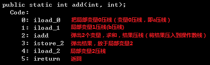

  尝试写段文字,接下来我要换行了  
  在上一行末尾加两个空格,markdown没有办法缩进  

# 这是一级标题
## 这是二级标题
### 这是三级标题
#### 这是四级标题
##### 这是五级标题
###### 这是六级标题
**这是加粗的文字**
*这是倾斜的文字*`
***这是斜体加粗的文字***
~~这是加删除线的文字~~
>这是引用的内容
>>这是引用的内容
>>>>>>>>>>这是引用的内容
---
***

[blockchain](../picture/add方法反编译.png "区块链")  
这里引用![blockchain]
[简书](http://jianshu.com)


- 列表内容
   - asd
+ 列表内容
* 列表内容

注意：- + * 跟内容之间都要有一个空格
1. 列表内容
2. 列表内容
3. 列表内容

注意：序号跟内容之间要有空格

| name | age |
| :---- | ---: |
| LearnShare | 12 |
| Mike |  32 |

`代码内容`
```
代码块asdasd
```


