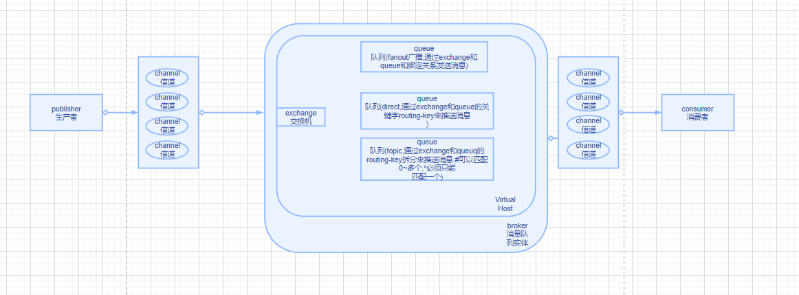

##RabbitMQ 是一个由 Erlang 语言开发的 AMQP 的开源实现。
####AMQP ：Advanced Message Queue，高级消息队列协议。它是应用层协议的一个开放标准，为面向消息的中间件设计，基于此协议的客户端与消息中间件可传递消息，并不受产品、开发语言等条件的限制。




- 1.Message       
  -  消息，消息是不具名的，它由消息头和消息体组成。消息体是不透明的，而消息头则由一系列的可选属性组成，这些属性包括routing-key（路由键）、priority（相对于其他消息的优先权）、delivery-mode（指出该消息可能需要持久性存储）等。  
- 2.Publisher     
  -  消息的生产者，也是一个向交换器发布消息的客户端应用程序。        
- 3.Exchange      
  -  交换器，用来接收生产者发送的消息并将这些消息路由给服务器中的队列。       
- 4.Binding       
  -  绑定，用于消息队列和交换器之间的关联。一个绑定就是基于路由键将交换器和消息队列连接起来的路由规则，所以可以将交换器理解成一个由绑定构成的路由表。        
- 5.Queue     
  -  消息队列，用来保存消息直到发送给消费者。它是消息的容器，也是消息的终点。一个消息可投入一个或多个队列。消息一直在队列里面，等待消费者连接到这个队列将其取走。      
- 6.Connection        
  -  网络连接，比如一个TCP连接。     
- 7.Channel       
  -  信道，多路复用连接中的一条独立的双向数据流通道。信道是建立在真实的TCP连接内地虚拟连接，AMQP 命令都是通过信道发出去的，不管是发布消息、订阅队列还是接收消息，这些动作都是通过信道完成。因为对于操作系统来说建立和销毁 TCP 都是非常昂贵的开销，所以引入了信道的概念，以复用一条 TCP 连接。       
- 8.Consumer      
  -  消息的消费者，表示一个从消息队列中取得消息的客户端应用程序。      
- 9.Virtual Host      
  -  虚拟主机，表示一批交换器、消息队列和相关对象。虚拟主机是共享相同的身份认证和加密环境的独立服务器域。每个 vhost 本质上就是一个 mini 版的 RabbitMQ 服务器，拥有自己的队列、交换器、绑定和权限机制。vhost 是 AMQP 概念的基础，必须在连接时指定，RabbitMQ 默认的 vhost 是 / 。                
- 10.Broker       
  -  表示消息队列服务器实体。

- Exchange分发消息时根据类型的不同分发策略有区别，目前共四种类型：direct、fanout、topic、headers 。headers 匹配 AMQP 消息的 header 而不是路由键，此外 headers 交换器和 direct 交换器完全一致，但性能差很多，目前几乎用不到了，所以直接看另外三种类型：      
  -  1.fanout 类似广播  交换机发送消息到所有绑定的队列里面.实际是通过路由和队列的绑定关系分发的
    发到 fanout 类型交换器的消息都会分到所有绑定的队列上去。fanout 交换器不处理路由键，只是简单的将队列绑定到交换器上，每个发送到交换器的消息都会被转发到与该交换器绑定的所有队列上。很像子网广播，每台子网内的主机都获得了一份复制的消息。fanout 类型转发消息是最快的。
  -  2.direct,实际就是通过一个路由key转发,所有direct模式必须有路由key
    消息中的路由键（routing key）如果和 Binding 中的 binding key 一致， 交换器就将消息发到对应的队列中。它是完全匹配、单播的模式。
  -  3.topic 也是通过路由键来分发.他把路由键切分几个单词并有两个通配符,#可以匹配0~多个, *只匹配一个单词。
    topic 交换器通过模式匹配分配消息的路由键属性，将路由键和某个模式进行匹配，此时队列需要绑定到一个模式上。它将路由键和绑定键的字符串切分成单词，这些单词之间用点隔开。它同样也会识别两个通配符：符号“#”和符号“”。#匹配0个或多个单词，匹配不多不少一个单词。


通过x-message-ttl 设置队列的过期时间,int类型,默认毫秒  过期后会移除消息.若绑定死信队列,则会放到死信队列中
或者通过给消息设置过期时间
~~~  MessagePostProcessor messagePostProcessor = message -> {
            message.getMessageProperties().setExpiration("5000");
            message.getMessageProperties().setContentEncoding("UTF-8");
            return message;
        };
~~~
如果两个都设置了过期时间,则以过期时间小的为准.建议把队列设置为过期时间,因为消息直接移除,过期队列会放入死信队列中


死信队列: 1.当消息过期后会放入死信队列 2.消息被拒绝. 3.队列达到最大长度
死信队列和死信交换机也是普通的队列和交换机. 只是被设置了死信关系
```
        args.put("x-dead-letter-exchange","dead_Exchange"); //将topic队列绑定上死信交换机
        args.put("x-dead-letter-routing-key","dead"); //死信队列key
```


设置mq占内存大小
rabbitmqctl set_vm_memory_high_watermark  0.6   按照比例.占60%
rabbitmqctl set_vm_memory_high_watermark absolute 2GB   按照大小 绝对值. 2GB

设置mq剩余硬盘大小多少报警
rabbitmqctl set_disk_free_limit 100G  //假设剩余的硬盘不够100G会报警

mq的内存换页
vm_memory_high_watermark.relative = 0.4
vm_memory_high_watermark_paging_ratio = 0.5    10G*0.4当内存使用率达到4G,在达到4G之前会把4*0.5=2G的消息从内存放到硬盘 不要大于1,内存达到极限,换页意义不大

